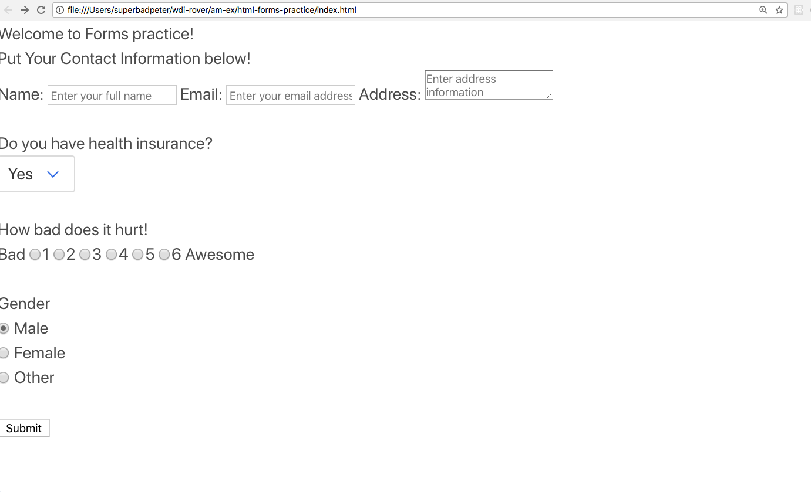
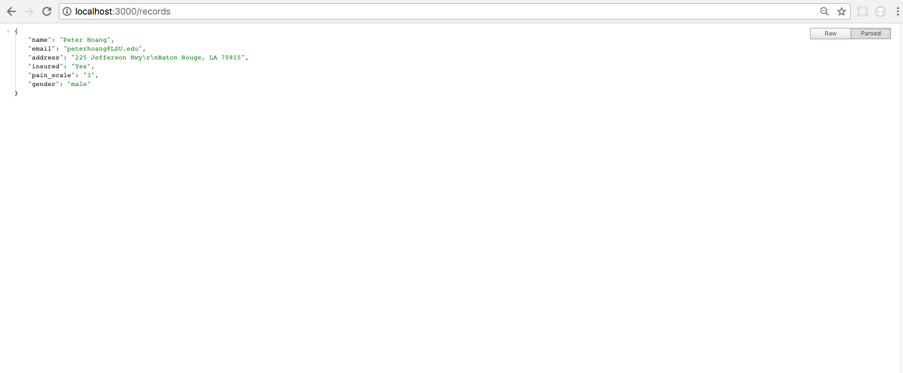

# html-forms-practice

Happy Friday!!!!!!

A client needs help with their application for a medical company this morning! So we need our awesome team of developers to create a form that will send a post to the back end! 

### Setup

- Fork and clone down this repo! 

- cd into html-forms-practice folder, run npm init, then npm install 

- Thanks to Skippy and the backend developers, we already have our server built out for us! So we can run the command, npm start to spin up our server. 

## 🚀 Task:

- You will be working in the index.html file. And it looks like someone started but didn't finish!

- You will need to complete building out the form to properly submit the correct information. 

## 🚀 Completion looks like:

- The index.html should look like this: 

- Once you hit submit, it will return an object. 

